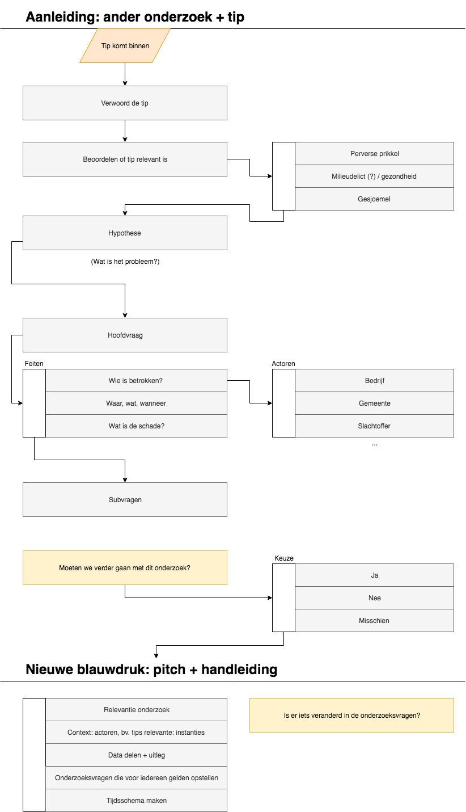

# Focusgroep

De grootste uitdaging van dit project is om een tool te bieden die helpt om blauwdrukken te maken, maar waarbij de werkwijze van de gebruiker nog onbekend is omdat deze nog niet eerder gemaakt is door deze gebruiker. Daarom is het belangrijk om de gebruiker alvast een blauwdruk te laten maken, zodat ik kan de mogelijke werkwijze kan vastleggen en daarop in kan spelen.

## De focus van de focusgroep
De Focusgroep bestaat uit 3 onderdelen.

1. `Opdracht 1` Inkomen in het onderwerp door middel van een discussie over `journalistiek onderzoek`. Met de onderliggende ondelen:
  * Wat werkt supergoed?
  * Waar loop jij tegenaan?
  * `Structuur behouden` hoe doe jij dat?
  Het is belangrijk dat ik de best-practices en drempels verzamel waar de participanten tegenaan loop.

2. `Opdracht 2` Het overdraagbaar maken van onderzoek. Een blauwdruk is een afgekaderde versie van het onderzoek of onderzoeksproces en die moet overdraagbaar zijn. Daarom wil ik eerst een onderzoek overdraagbaar maken en dan pas gaan kijken hoe dit als een blauwdruk verwerkt zou kunnen worden. Tijdens dit onderdeel is het de bedoeling dat de participanten eens kritisch gaat kijken hoe een specifiek onderzoek overdraagbaar kan worden gemaakt. De uitvoering mag op een eigenmanier gedaan worden, maar om het eenvoudige te houden liggen er sticky notes klaar. De sticky notes kunnen gebruikt worden om onder andere: 
  * Instructies te geven
  * Suggesties te geven
  * Referenties achter te laten
  * Beknopte werkwijzes achter te laten

3. `Opdracht 3` Een eerste blauwdruk maken. Ook bij dit onderdeel mag de uitvoering op een eigenmanier uitgevoerd worden. Het is natuurlijk een grote stap voor een eerste versie. Daarom is het belangrijk dat ik alvast een suggestie geef over hoe dit uitgevoerd zou kunnen worden.

## Uitnodiging voor de focusgroep

> Beste *,
>
>
> Het komende halfjaar ga ik mij bezighouden met mijn afstudeerproject: het ontwikkelen van een blauwdruk voor onderzoeksprojecten.
>
> Wat houdt dat in?
>
> Ik ga mij bezig houden met het ontwikkelen van een tool die jij als journalist kunt gebruiken om een ‘blauwdruk’ van je onderzoeksproces te maken. Dat wil zeggen: je kunt hem gebruiken om de stappen bij te houden die jij hebt gezet om je aannames en hypotheses te toetsen.
>
>
> In dat proces loop ik echter wel tegen een paar uitdagingen op:
>
> Hoe kan de onderzoeksjournalist naast het produceren van artikelen, zijn of haar onderzoeksproces omzetten naar een blauwdruk? Hoe zorg je ervoor dat zo’n blauwdruk toegankelijk, transparant, reproduceerbaar en schaalbaar is? Hoe kun je deze toepassen voor (nieuwe) artikelen en dossiers? En, aan de ethische kant: hoe zorg je ervoor dat de informatie van het onderzoek gewaarborgd blijft?
>
>
> Daarom heb ik jullie hulp hard nodig.
> 
> Om dit project van valide input te voorzien, ben ik van plan om een focusgroep-sessie te organiseren.
>
>
> Datum: dinsdag 4 juni
> Tijd: van 15:00 tot 16:15.
>
>
> Dit gaan we doen (dus je kunt hier alvast over nadenken):
>
> * Brainstormen over journalistiek onderzoek (30 min)
>   * Wat gaat supergoed en wil je graag delen?
>   * Waar loop jij tegenaan met het onderzoek waar je nu mee bezig bent?
>   * Wat vind jij een handige manier om structuur in je onderzoek te behouden?
>
> * Een onderzoek van iemand anders bekijken en uitzoeken hoe deze overdraagbaar gemaakt kan worden voor je collega en jezelf. Dit is de eerste stap richting een blauwdruk. (20 min)
>   * Welke onderdelen moet je in ieder geval overdragen?
>   * Welke onderdelen kan je beter niet overdragen en zouden later via jou moeten verlopen?
>   * In welke vorm zou je je verzameling overdragen?
>
> * De informatie vanuit het punt hierboven selecteren / groeperen / organiseren / filteren die alleen specifieke belanghebbenden mogen inzien. Tijdens deze bezigheid is het belangrijk om de relevantie te bepalen van de informatie. (15 min)
> 
> Laat me weten of je erbij kunt zijn, dan weet ik hoeveel stroopwafels ik moet halen ;-).
> 
> 
> Groetjes,
> 
> Jorik van Essen

## Presentatie focusgroep

[Presentatie slides](https://iiyama12.github.io/Project-blauwdruk_html-content/focusgroep-presentatie/assets/player/KeynoteDHTMLPlayer.html)

Note: In de presentatie is de navigatie verstopt aan de ***linkerkant*** van het ***zwarte gedeelte*** tegen de ***kantlijn*** aan.

## Bevindingen opdracht 1
`Opdracht 1`

Uitgevoerd door de: groep
* Als een onderzoeksjournalist zijn onderzoek op een hoog structuur niveau wil uitvoeren via de Google apps is de kans groot dat hij of zij te veel browser tabs open zal hebben. 
* Structuur aanbrengen kost tijd en deze tijd zal zich alleen terugwinnen wanneer je de informatie op een later moment weer gaat ophalen. De onderzoeksjournalist maakt de keuze hoe gestructureerd hij of zij dit wil gaan doen aan de hand van het grootte van het onderzoek. De drempel verschild wel per onderzoeksjournalist, er is geen standaard voor.
* De tijdslijn werkt goed als methode om structuur te geven aan een onderzoek. Maar niet elke onderzoek leent zich daarvoor.
* Koppelingen naar (onderzoeks)rapporten zijn relevant.
* Het uitschrijven van alle onderzoeksvragen geeft structuur. Deze zijn van belang wanneer er wederhoor plaats moet vinden.
* Het markeren van tekst is een manier voor onderzoeksjournalisten om hiërarchie te creëren.
  * Liner web extensie
* Screenshot van rapport/document wordt als relevant beschouwd.
* De tools Evernote en Onenote worden door sommige voor documentatie gebruikt
* Als je een blauwdruk gaat bekijken vanuit een onderzoeksjournalist
  1. Moet je eerst het opbouw begrijpen
  2. Daarna pas kan je de data gaan bekijken en begrijpen
* Volgens de onderzoeksjournalist zal een blauwdruk alleen zijn functie kunnen vervullen wanneer deze op een adviserende manier informatie probeert over te brengen. 
* Verbanden tussen bijvoorbeeld organisaties en personen kunnen relevant zijn.
* De vraag: "Welke informatie gaan we weggeven?" is relevant en voor wie. Welke bronnen mogen gedeeld worden voor collega's en de eindredactie.
* Uitleggen hoe iets gedaan is, kan discussie creëren of juist voorkomen. Het is in iedergeval meer transparant.
* Eenheid in data speelt is in bepaalde onderzoeken relevant. Deze onderzoeken worden in dit geval uitgevoerd door meerdere mensen. 
  * Jorik: Het is ook relevant voor multidisciplinair samenwerken.

## Bevindingen opdracht 2
`Opdracht 2`

Hoe maak je het onderzoek dat nu voor je ligt overdraagbaar aan je collega?

Dit zou je duidelijk kunnen maken door middel van:
* Instructies (Hoe moet dit onderzoek gelezen worden?)
* Suggesties (Hoe zou dit onderzoek kunnen voortzetten?)
* Verbanden (Welke verbanden spelen een rol in dit onderzoek?)
* Werkwijze (Hoe ben je tot dit resultaat gekomen?)

### Case Taxateurs
 Uitvoering opdracht door: [Peter Hendriks](https://www.ftm.nl/auteur/peter-hendriks) & [Liset Hamming](https://www.ftm.nl/auteur/liset-hamming)

Deze case staat in de stijgers en is niet voor het publiek inzichtelijk.

#### Instructie
> * Onderwerp
> * Hypothese
> * Schets & cijfers
>   * Achtergrond

#### Suggesties
> 1. Bel eens rond
>   * Zo dichtbij mogelijk
>   * Informeel
>   * Off the record
> * = in beeld krijgen
> 2. Googlen (zoeken) op rapporten/onderzoeken + screenen
>   * Wie uitgegeven voor samenvatting
>   * = quotes
> 3. In een word bestand zet ik de links
>   * De namen
>   * De samenvattingen
>   * Highlights quotes + zinnen uit rapporten

#### Verband
> Welke belangen spelen er.

#### Werkwijze
> Tip om mij te begrijpen:
> 1. Ik wil zo snel mogelijk schrijven
> 2. Alles wat ik nodig heb / gebruiken staat er dan al

## Bevindingen opdracht 3
`Opdracht 3`

Uitgevoerd door de: groep (alle onderzoeksjournalisten die momenteel aanwezig waren)

__Vertaling naar diagram__

