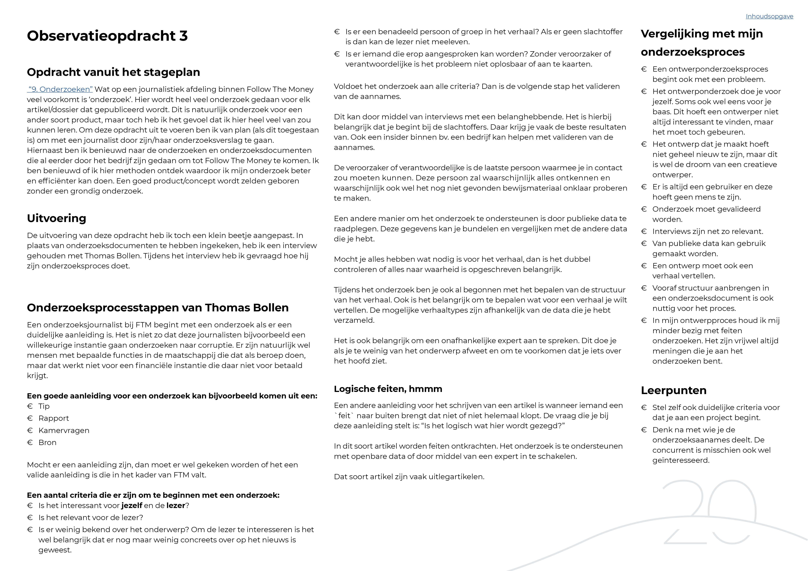

# Werkwijze Thomas Bollen

De werkwijze van Thomas Bollen had ik verzameld tijdens mijn stageperiode. Deze informatie heb ik niet voor de afstudeeropdracht verzameld, maar blijkt nu relevant te zijn geworden voor dit project. 

Een remake van de informatie hierboven:

## Onderzoeksprocesstappen van Thomas Bollen
Een onderzoeksjournalist bij FTM begint met een onderzoek als er een duidelijke aanleiding is. Het is niet zo dat deze journalisten bijvoorbeeld een willekeurige instantie gaan onderzoeken naar corruptie. Er zijn natuurlijk wel mensen met bepaalde functies in de maatschappij die dat als beroep doen, maar dat werkt niet voor een financiële instantie die daar niet voor betaald krijgt.

### Een goede aanleiding voor een onderzoek kan bijvoorbeeld komen uit een:
* Tip
* Rapport
* Kamervragen
* Bron

### Mocht er een aanleiding zijn, dan moet er wel gekeken worden of het een valide aanleiding is die in het kader van FTM valt.

Een aantal criteria die er zijn om te beginnen met een onderzoek:
* Is het interessant voor jezelf en de lezer?
* Is het relevant voor de lezer?
* Is er weinig bekend over het onderwerp? Om de lezer te interesseren is het wel belangrijk dat er nog maar weinig concreets over op het nieuws is geweest.
* Is er een benadeeld persoon of groep in het verhaal? Als er geen slachtoffer is dan kan de lezer niet meeleven.
* Is er iemand die erop aangesproken kan worden? Zonder veroorzaker of verantwoordelijke is het probleem niet oplosbaar of aan te kaarten. 

### Validatie aannames
Voldoet het onderzoek aan alle criteria? Dan is de volgende stap het valideren van de aannames.

Dit kan door middel van interviews met een belanghebbende. Het is hierbij belangrijk dat je begint bij de slachtoffers. Daar krijg je vaak de beste resultaten van. Ook een insider binnen bv. een bedrijf kan helpen met valideren van de aannames.

De veroorzaker of verantwoordelijke is de laatste persoon waarmee je in contact zou moeten kunnen. Deze persoon zal waarschijnlijk alles ontkennen en waarschijnlijk ook wel het nog niet gevonden bewijsmateriaal onklaar proberen te maken.

Een andere manier om het onderzoek te ondersteunen is door publieke data te raadplegen. Deze gegevens kan je bundelen en vergelijken met de andere data die je hebt.

### Verzameling compleet
Mocht je alles hebben wat nodig is voor het verhaal, dan is het dubbel controleren of alles naar waarheid is opgeschreven belangrijk. 

### Structuur bepalen
Tijdens het onderzoek ben je ook al begonnen met het bepalen van de structuur van het verhaal. Ook is het belangrijk om te bepalen wat voor een verhaal je wilt vertellen. De mogelijke verhaaltypes zijn afhankelijk van de data die je hebt verzameld.

### Expert
Het is ook belangrijk om een onafhankelijke expert aan te spreken. Dit doe je als je te weinig van het onderwerp afweet en om te voorkomen dat je iets over het hoofd ziet.

