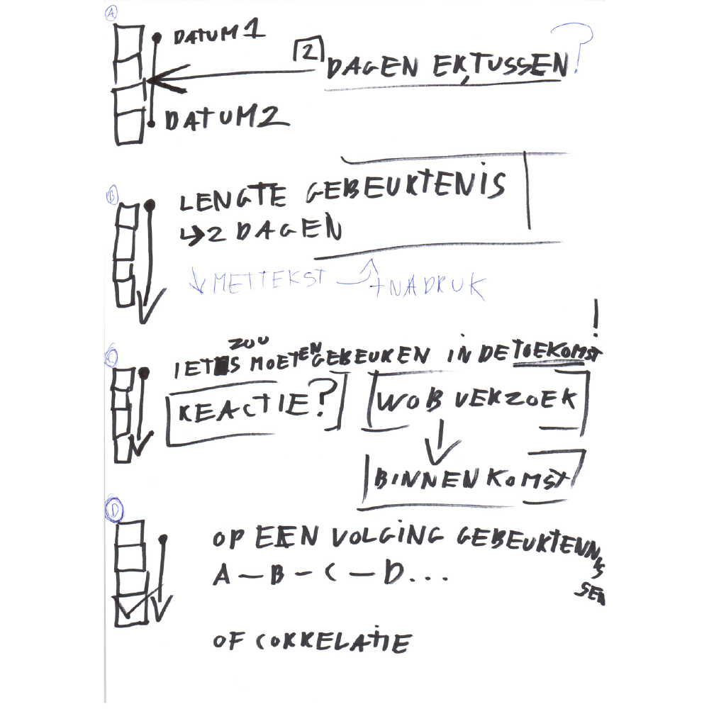

# Interview tijdlijn-2.0.0

Interviewvragen: `tijdlijn-2.0.0`

## Interview 1

### Aanleiding
Testen van 4 tijdlijn ideeën en of deze toegevoegde waarde hebben voor de onderzoeksjournalist.

### 4 tijdlijn ideeën
1. (A) De tijdlijn geeft tussen de gebeurtenissen aan hoeveel tijd er tussen zit.
Doel: Om mogelijke gemiste gebeurtenissen te controleren.

2. (B) De tijdlijn geeft aan hoe lang een gebeurtenis duurt.
Doel: Gebeurtenissen varieren in tijdsduur, deze informatie zou relevant kunnen zijn.

3. (C) De tijdlijn kan per gebeurtennis aangeven of er iets in de toekomst moet gaan gebeuren. Bijvoorbeeld: Wanneer moet een [WOB verzoek](https://www.om.nl/organisatie/wet-openbaarheid/) verwerkt zijn?
Doel: Sommige gebeurtenissen hebben de eigenschap of doel op iets in de toekomst te laten gebeuren. Bijvoorbeeld: Door een voicemail in te spreken kan ervoor zorgen dat iemand gaat terugbellen.

4. (D) De tijdlijn kan een op een volging van gebeurtenissen aan elkaar knopen.
Doel: Om oorzaken en gevolgen in kaart brengen.

## Voorbereiding

* Eerste tijdlijn schetsen laten zien
* De 4 ideeën voorlichten. (aanleiding)

