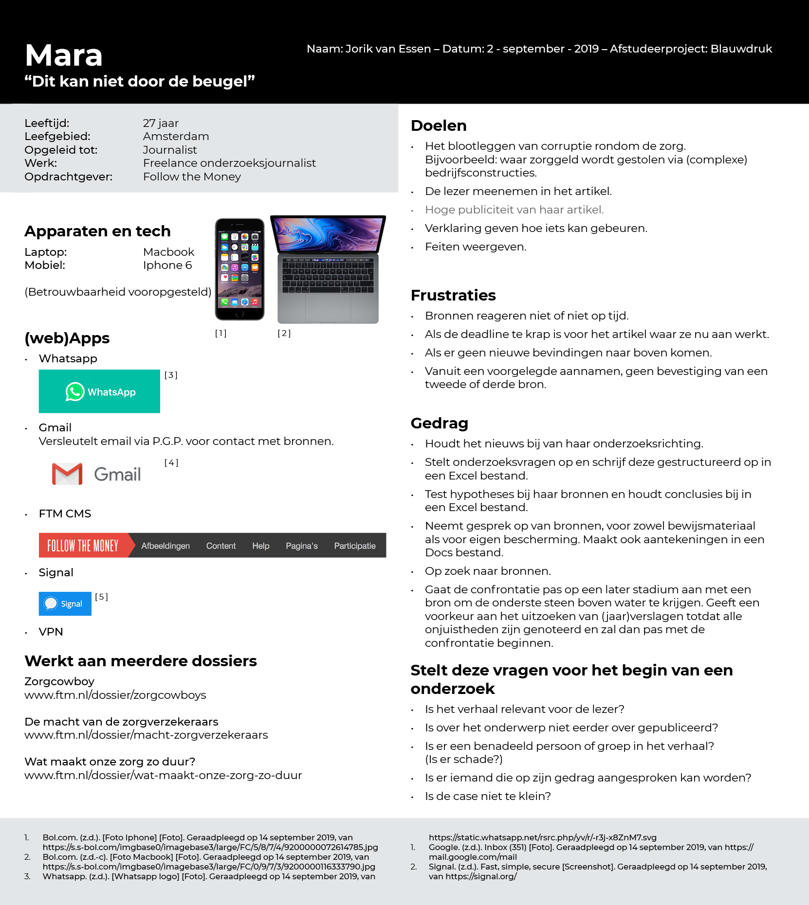

# Persona

Van de onderzoeksjournalist heb ik 2 persona's gemaakt. Elk gebaseerd op twee verschillende werkwijzen, die hieronder worden weergegeven.

## Belangrijke onderscheidbare werkwijzen met onderzoeksdata

Het bijhouden van een onderzoek kan je met je hersenen doen of deze op te schrijven.

Het type medium mag je er zelf bij bedenken. 


Kortom, deze onderscheidbare werkwijze hebben te maken met informatie
* Opschrijven (in een medium)
* Onthouden (met je hersenen)

De werkwijze onthouden is altijd aanwezig, je begint met je onderzoek en onthoud de belangrijkste informatie.
De werkwijze opschrijven doe je om de cognitievelading te verminderen, zodat je weer nieuwe informatie kan opnemen.

Het is niet als of je moet kiezen welke werkwijze er nodig is om een onderzoek uit te voeren. Je kan ook ongeveer 30% onthouden en 70% opschrijven proberen. (per onderdeel dat je onderzoekt of het onderzoek in zijn geheel)

Onderzoekers en onderzoeksjournalist hebben vaak te maken met veel onderzoeksinformatie. De hoeveelheid onderzoeksinformatie die je wegschrijft en juist probeert te onthouden heeft grotendeels met jouw voorkeur te maken. (Wat werkt goed voor jouw?) Alles proberen te onthouden betekend ook meer risico dat je iets daarvan vergeet en meer opschrijven __kan__ betekenen dat het langer duurt voordat je het teruggevonden hebt. Er komen nog andere scenario's bij kijken, zoals "je weet de informatie wel, maar je kan het op dat moment niet meer herrineren." of "je raakt je notities kwijt". Kenbaar?

De belangrijkste informatie die voor mij belangrijk is: Wanneer gaat de doelgroep `onderzoeksjournalist` tijd en energie steken in het invoeren van de informatie die nodig is om het product te laten werken waar het voor bedoeld is?

Persona 1 heb ik voor de `gedrag` eigenschappen ingevuld in de richting van: `meer opschrijven`.

Persona 2 heb ik voor de `gedrag` eigenschappen ingevuld in de richting van: `meer onthouden`.
