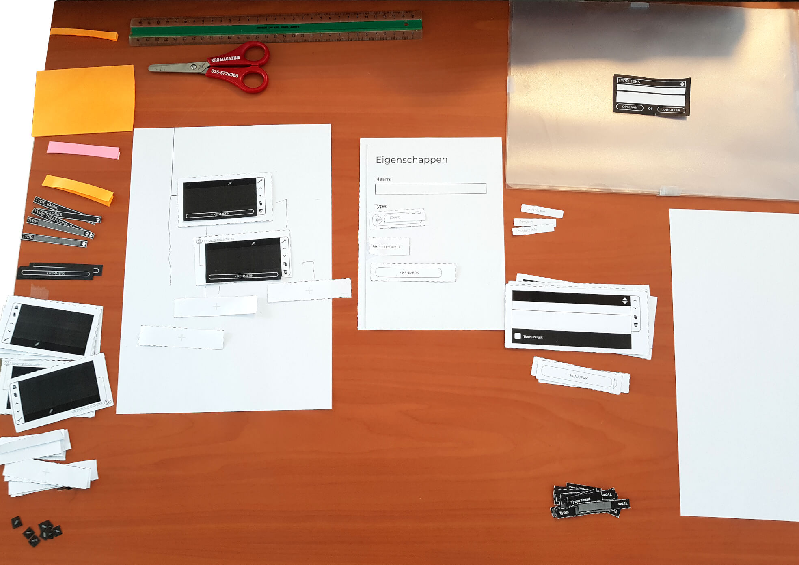

# Papier prototype

## Hiërarchie informatie invoer van personen/organisaties

### Onderdelen

[Prototype 1.0.0 – onderdelen voorbereiden](content/1.0.0/prototype-1.0.0-components.jpg)

### Uitvoering

## Onderzoeksvragenlijst concept 

**TODO**