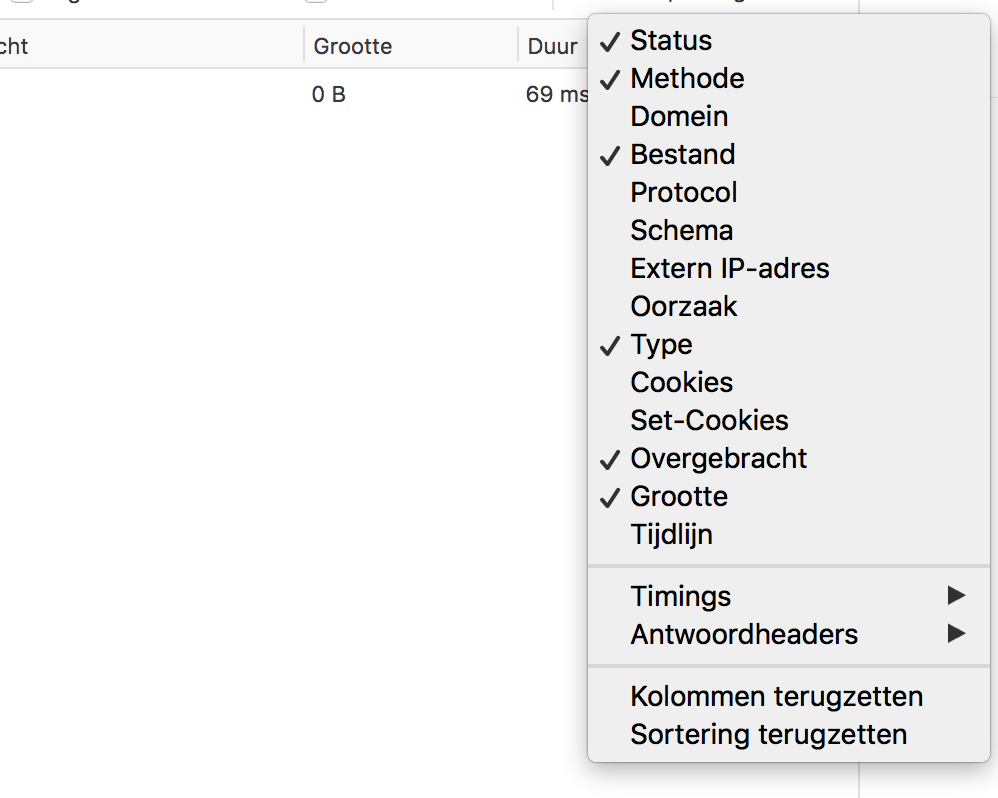
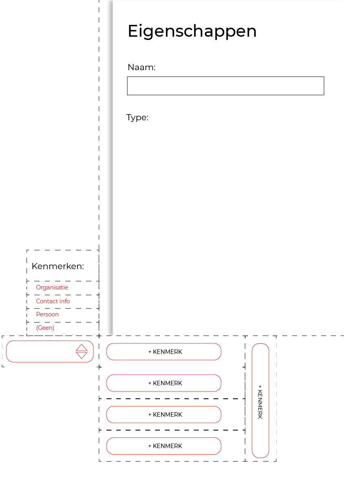
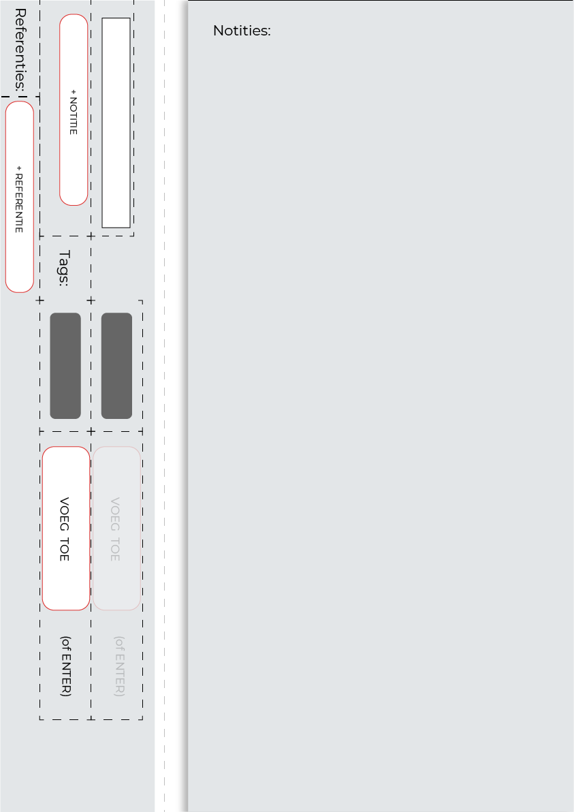
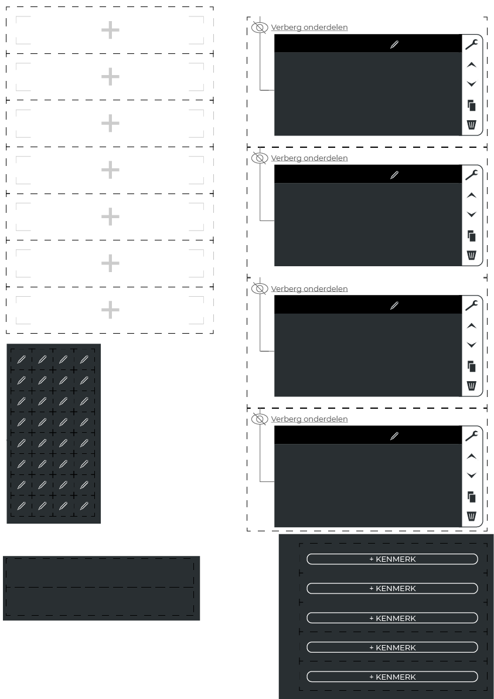
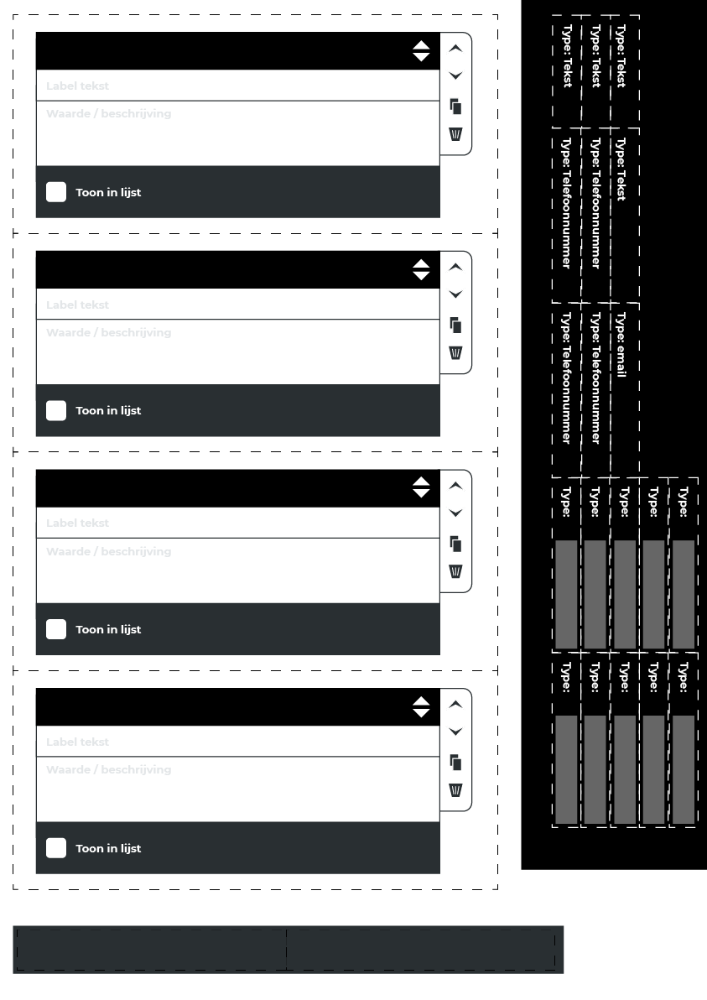
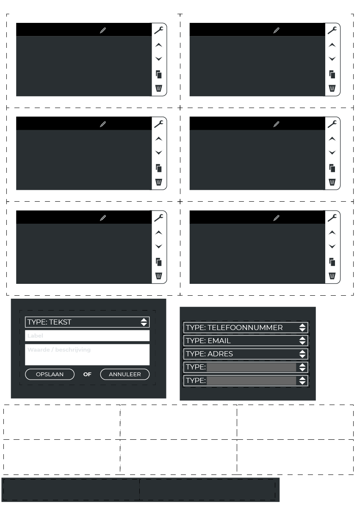

# Papier prototype

## Hiërarchie informatie invoer van personen/organisaties

### Prototype 1.0.0
Dit prototype is voortgekomen uit het concept:
[Concept boom hiërarchie](https://app.gitbook.com/@jorik/s/project-blauwdruk/concepten/boom-hierarchie)

Tijdens het uitvoeren van het prototype wordt er gekeken naar of een `boom hiërarchie` user interface de gebruiker kan voorzien van een meerwaarde in vergelijking met een tabel structuur. Deze keuze basseer ik op de aannamen: Naarmate de eigenschappen van entiteiten(bv. persoon / organisatie) groeien in een tabel layout, wordt de tabel minder overzichtelijk omdat er meer kolommen bijkomen. (Elke kolom staat voor een eigenschap van een entiteit)

Voorbeeld tabel layout
| Eigenschap: a | Eigenschap: B | Eigenschap: C |
|---------------|---------------|---------------|
| [waarde]      | [waarde]      | [waarde]      |
| [waarde]      | [waarde]      | [waarde]      |
| [waarde]      | [waarde]      | [waarde]      |

Voorbeeld van een boom hiërarchie layout:

[Meer voorbeelden van een `boom hiërarchie` weergave? (Google)](https://www.google.com/search?client=firefox-b-d&channel=trow&biw=2332&bih=1397&tbm=isch&sa=1&ei=CPIIXZb-GYaRmwXg6ZXwCQ&q=boom+hi%C3%ABrarchie+data&oq=boom+hi%C3%ABrarchie+data&gs_l=img.3...6287.6287..6648...0.0..0.42.42.1......0....2j1..gws-wiz-img.Iv0y6k-_MpY)

De meerwaardes: `Boom hiërarchie`
* Onderdelen kunnen onder elkaar worden geschoven. Bijvoorbeeld een persoon kan onder een organisatie worden geschoven. Dit kan ook andersom gedaan worden.
* Eigenschappen van een entiteit: Het aantal eigenschappen en de volgorde daarvan zit niet zoals bij een grid vast aan kolommen.

De meerwaardes: `Tabel`
* Met een tabel zit je vast aan een grid. Het voordeel van een tabel is dat je alle zelfde soort gegevens onder elkaar kan zetten door te soorteren via kolommen.
* Het is mogelijk om bepaalde kolommen met minder relevante informatie niet te tonen. Kijk maar hoe Firefox dit oplost: 

[Dit is een screenshot van de Firefox Netwerk tab dat beschikbaar is via het inspector menu.](https://developer.mozilla.org/en-US/docs/Tools/Network_Monitor)

De `Tabel` weergave is hele goede manieren om informatie van entiteiten weer te geven. Maar toch kan een tabel niet hiërarchie op meerdere lagen weergeven dat een `Boom hiërarchie` wel kan.

**Voorbeeld van data waarbij een Boom hiërarchie een belangrijke rol kan spelen**
* Organisatie A (entiteit)
  * Persoon A (entiteit)
    * Loon (Eigenschap)
    * Contactgegevens (entiteit als lijst)
      * Telefoonnummer 1 (Eigenschap)
      * Telefoonnummer 2 (Eigenschap)
      * Email (Eigenschap)
  * Persoon B (entiteit)
    * Loon (Eigenschap)
      * Contactgegevens (entiteit als lijst)
        * Telefoonnummer (Eigenschap)
  * Persoon C (entiteit)
    * Loon (Eigenschap)
* Organisatie B (entiteit)
  * Persoon D (entiteit)
    * Loon (Eigenschap)

#### Onderdelen

[Prototype 1.0.0 – onderdelen voorbereiden](content/1.0.0/prototype-1.0.0-components.jpg)

#### Uitvoering

## Onderzoeksvragenlijst concept 

**TODO**