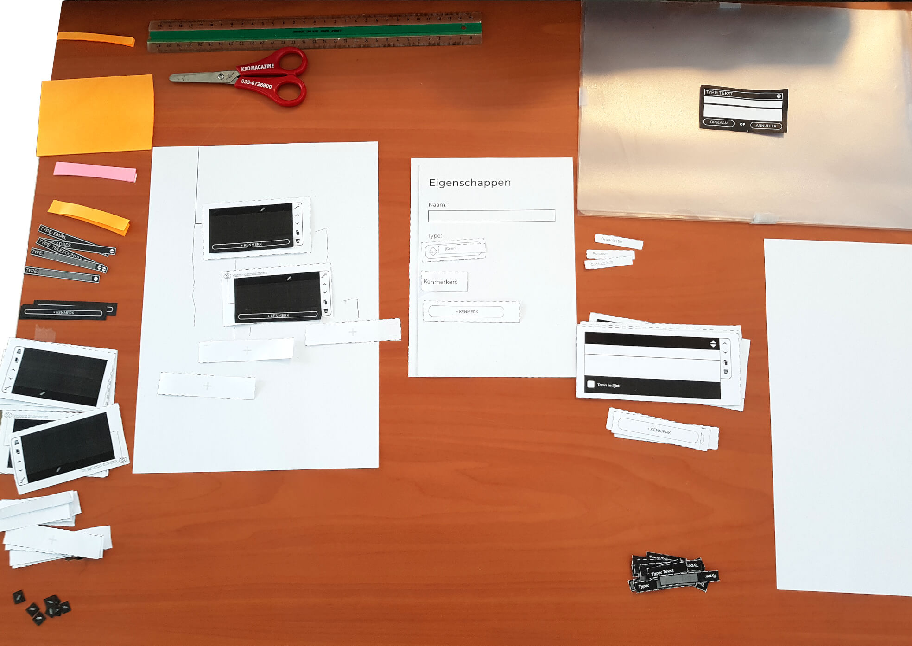

# Boom hiërarchie

## Hiërarchie informatie invoer van personen/organisaties

### Prototype 1.0.0
Dit prototype is voortgekomen uit het concept:
[Concept boom hiërarchie](https://app.gitbook.com/@jorik/s/project-blauwdruk/concepten/boom-hierarchie)

Tijdens het uitvoeren van het prototype wordt er gekeken naar of een `boom hiërarchie` user interface de gebruiker kan voorzien van een meerwaarde in vergelijking met een tabel structuur. Deze keuze basseer ik op de aannamen: Naarmate de eigenschappen van entiteiten(bv. persoon / organisatie) groeien in een tabel layout, wordt de tabel minder overzichtelijk omdat er meer kolommen bijkomen. (Elke kolom staat voor een eigenschap van een entiteit)

__Voorbeeld tabel layout__

| Eigenschap: a | Eigenschap: B | Eigenschap: C |
|---------------|---------------|---------------|
| [waarde]      | [waarde]      | [waarde]      |
| [waarde]      | [waarde]      | [waarde]      |
| [waarde]      | [waarde]      | [waarde]      |

__Voorbeeld van een boom hiërarchie layout:__

#### Onderdelen



[Prototype 1.0.0 – onderdelen voorbereiden](content/prototype-1.0.0-components.jpg)

#### Uitvoering



