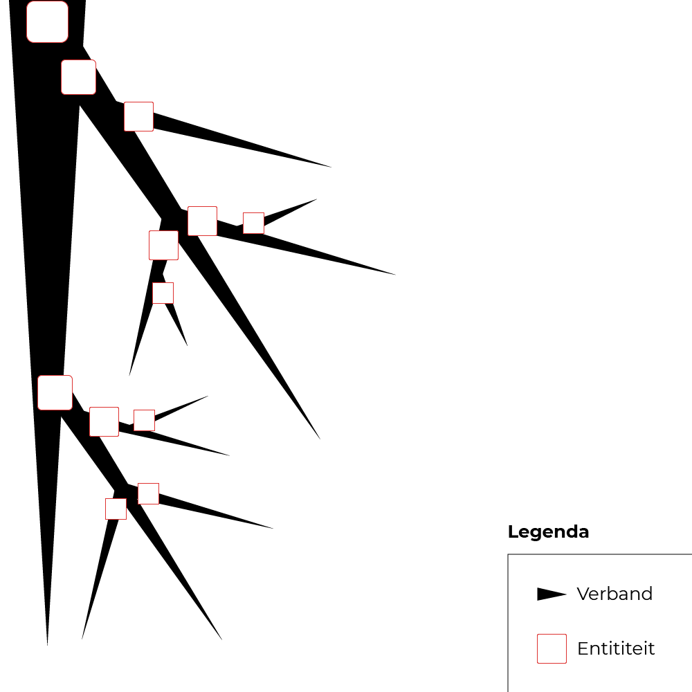
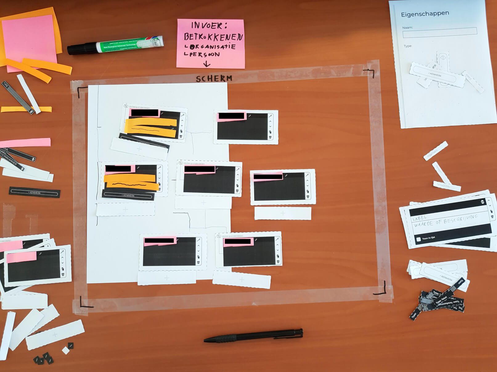
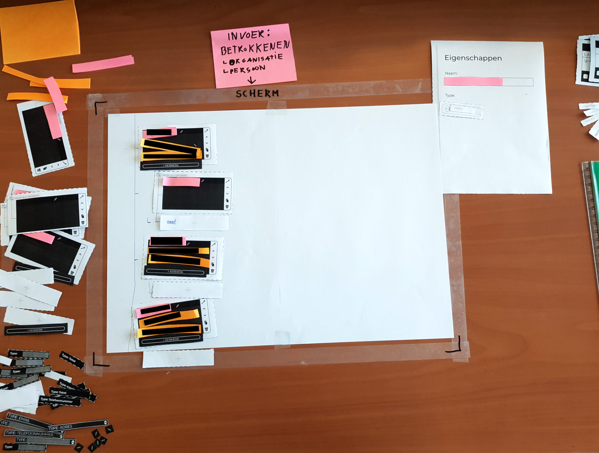

# Resultaten

## Gebruikerstest 1

Gebruiker: [Ties Joosten](https://www.ftm.nl/auteur/ties-joosten)

### Bevindingen:
* Ties zou de boomhiërarchie graag ook gebruiken om het gehele verband in kaart te brengen. Hij liep tegen deze limitatie aan: **In het geval wanneer er verbanden worden weergegeven, kunnen sub-items onder meer dan 1 hoofd-item worden geplaatst.** Uitleg: *Een boomhiërarchie vertakt zich maar 1 kant op. Wortels kunnen normaal gesproken niet samenkomen en tot een nieuwe stam uitgroeien (, die zich vervolgens weer vertakt).*  Zie afbeelding:

* In zijn eerste poging gebruikte hij de boomhiërarchie horizontaal in plaats van verticaal.
* Wanneer er op de knop `Kenmerk` wordt gedrukt, verwacht de gebruiker om informatie achter te laten dat betrekking heeft tot het bijbehorende item. (De knop zit bevestigd op het item)
* Het toevoegen van nieuwe items in een bepaalde hiërarchie wordt begrepen, mits de verbinden niet goed zichtbaar zijn. In het geval van het toevoegen van een sub-item, moet de knop onder het hoofd-item worden geplaatst. Note: Een verbindingslijntje speelt een belangrijke rol.


De informatie van deze afbeelding is onherkenbaar gemaakt vanuit een ethisch standpunt omdat er geen fictieve content is ingevuld.


## Gebruikerstest 2

Gebruiker: [Dennis Mijnheer](https://www.ftm.nl/auteur/Dennis-Mijnheer)

### Bevindingen

* Gebruikt voor een bron ongeveer 8 kenmerken. (naam, telefoonnummer, email ect.)
* Voor een bron schrijft hij vaak een URL naar een LinkedIn pagina op.
* Werkt veel met Excel om informatie van bronnen te noteren.
* Aannamen van Dennis: De hiërarchie van bronnen kan worden bepaald aan de hand van de informatiewaarde die zij afgeven.


De informatie van deze afbeelding is onherkenbaar gemaakt vanuit een ethisch standpunt omdat er geen fictieve content is ingevuld.
