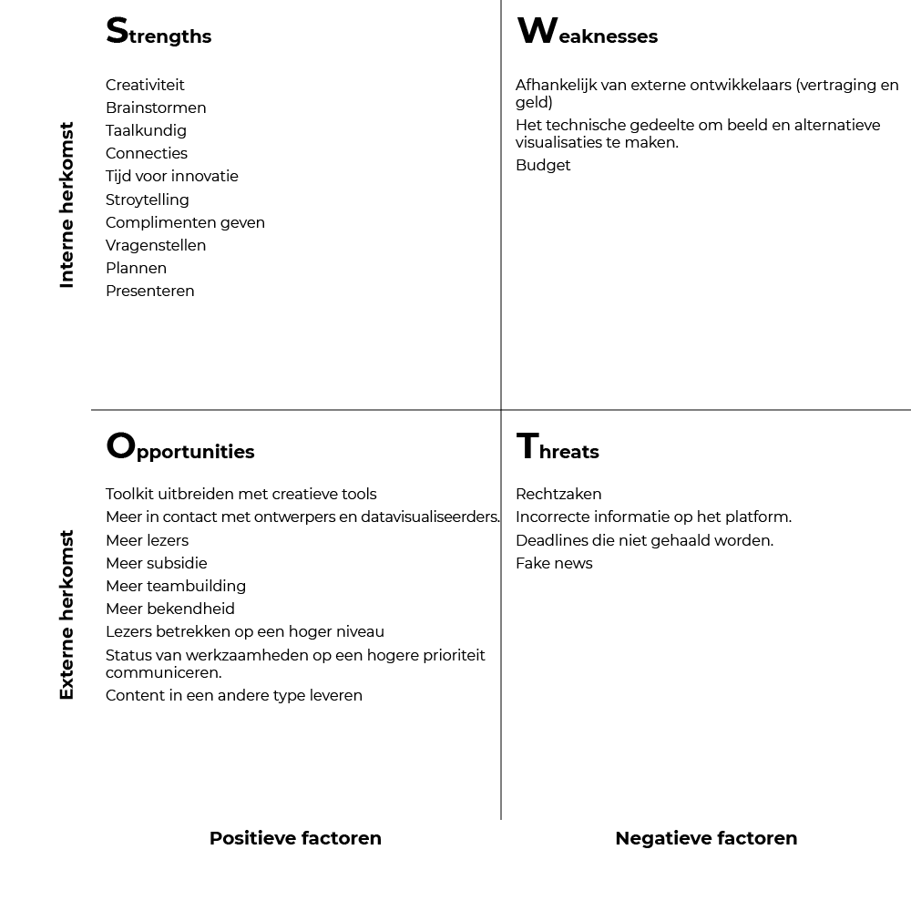

# SWOT analyse

## S W O T
* Strengths
* Weaknesses
* Opportunities
* Threats

## Waarom?
Deze methode geeft inzicht in waarin het bedrijf Follow the Money goed in is, minder goed in is, de gevaren waarop gelet moet worden en waar kansen liggen. Vanuit deze analyse kan ik als ontwerper gaan kijken waar ik risico's kan vermijden en in kan spelen op kansen.

## Uitvoering

SWOT analyse van het bedrijf Follow the Money.

 [Afbeelding](content/swot.png)

### Strengths
Follow the Money besteed heel veel tijd en energie in het presenteerbaar maken van de verhalen die gepubliceerd worden. Er zit een iteratief proces achter waarbij het content langs verschillende stakeholders gaat voor dat dit gepubliceerd kan worden.

In dit proces worden:
* Veel vragen gesteld
* Het verhaal op begrijpbaarheid gecontroleerd.
* Taalkundigheden gecorrigeerd.

Dit proces is vaak ook toegepast op al het andere content. Zoals: zakelijke mailings, social media uitingen, beeldmateriaal met tekst, presentaties.

### Weaknesses – Opportunities
Follow the Money is een bedrijf dat ten alle tijden opzoek is naar vernieuwing, maar wordt voornamelijk gehinderd door technische limitaties om ideeën / concepten binnen een deadline te realiseren. Deze limitatie neemt gelijkmatig af bij de groei van connecties met mensen vanuit de creatieve en technische sector.

