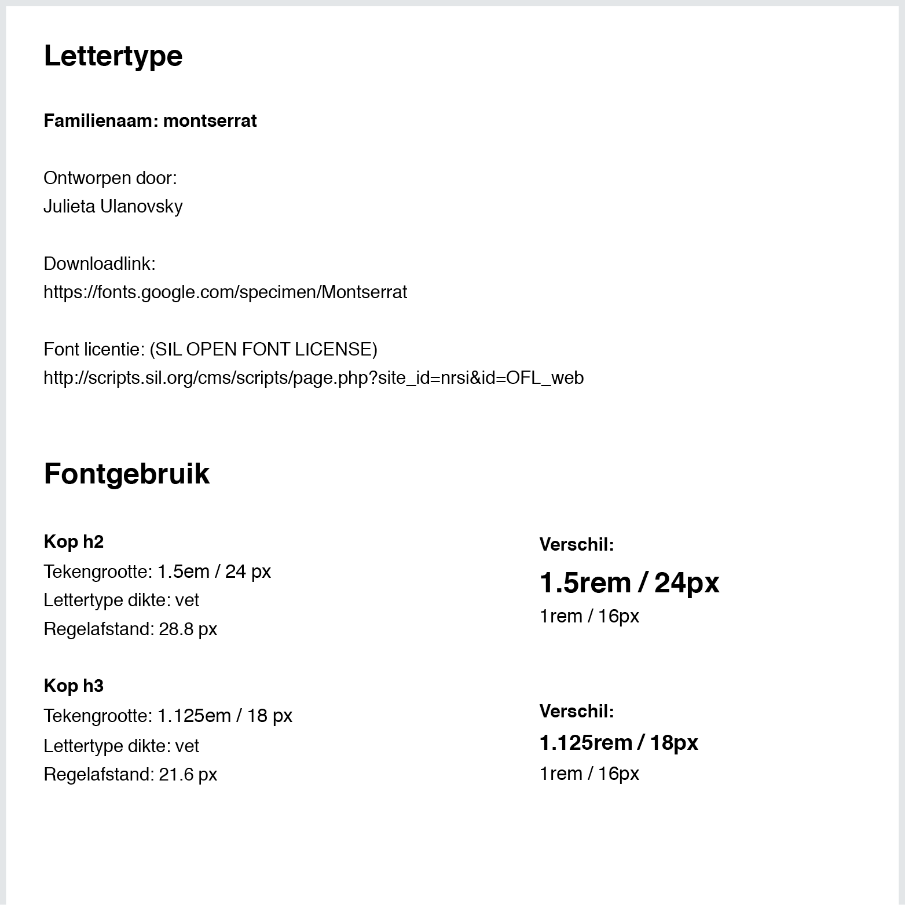

# Stijlgids

Inbegrepen
- [x] Kleurgebruik
- [x] Logo en beeldmerk
- [x] Lettertype
- [x] Fontgebruik
- [x] Interactie elementen

Dit zijn de kleuren die in de huisstijl van Follow the Money worden gebruikt. Op de website worden veel grijs tinten gebruikt in combinatie van redactioneel beeld. De felle kleuren zoals rood worden in op de redactionele pagina's subtiel gebruikt voor call to action onderdelen of om belangrijke onderdelen uit te lichten. Rode onderdelen zijn in de meeste gevallen klikbaar.

<!--Op de website wordt veel redactioneel beeld gebruikt, deze brengen de content tot leven. -->

Het logo en beeldmerk worden vaak samengebruikt als herkenningspunt voor het merk. Het logo kan als een diapositief versie gebruikt worden voor donkere achtergronden.

Voor het product heb ik gekozen om alleen het logo te gebruiken omdat naar mijn mening het beeldmerk minder tot zijn recht komt in de bovenbalk. Het oogt vervuilend.

Dit lettertype is onderdeel van de Follow the Money huisstijl. 

Het font word zowel voor de koppen als een deel van de broodtekst gebruikt op de FTM website. In het product wordt het font overal doorgevoerd om voor eenheid te zorgen

 

Voor de grote lappen broodtekst in de verhalen wordt het font PT-Serif gebruikt. Dit font heb ik niet opgenomen in het product, omdat deze qua visuele stijl niet heel mooi tot zijn recht komt. Het is ook een schreefletter en de schreef (streepjes aan de onderkant van de letter) verbeterd de leesbaarheid niet zodanig voor kort en bondige stukken tekst. Dit heeft alleen een toegevoegde waarde voor grote stukken tekst.

De call to action knop komt in het gebruikersinterface voor wanneer de gebruiker één enkele actie voor zich heeft. In het ontwerp 'visuele weergave' komt deze knop bijvoorbeeld voor wanneer de gebruiker wil zien waar een gebeurtenis (vanuit verbanden) zich bevindt in de tijdlijn.

Het 'select item' element wordt gebruikt om een keuze te maken van bijvoorbeeld een status.

De 'gekoppelde onderdelen' knop heeft als functie om gekoppelde onderdelen te bekijken. Dit geeft de onderzoeksjournalist de mogelijkheid om detailinformatie te bekijken van deze onderdelen. Onderdelen die momenteel worden ondersteund zijn bronnen en documenten. Deze worden gezamenlijk gebruikt voor broninformatie en de validatie er van.

De onderdelen bronnen en documenten hebben een grid indeling. Deze indeling wordt gebruikt om informatie te groeperen die meer als detailinformatie dienen, in plaats van onderzoeksverhaal leidend zijn.

Het tonen van meer of minder content is relevant wanneer de onderzoeksjournalist te veel informatie aan een item toevoegt. Wanneer een item te groot wordt kan dit zorgen voor te veel scrollen en dat maakt het ontwerp inefficiënt om te gebruiken. Het verkorten van de informatie zorgt voor minder scrollen en dat zorgt voor een beter overzicht van alle items.

__De ga naar content knoppen bestaan uit:__

* Beschrijving
* Pijl

De knop begint eerst met de beschrijving en wordt opgevolgd door de pijl. Deze volgorde heb ik gehanteerd omdat de knop wordt gebruikt in een modal en wanneer de gebruiker er op klikt verlaat hij of zij het modal. De pijl wijst daarom  buiten het modal en niet naar de beschrijving.
