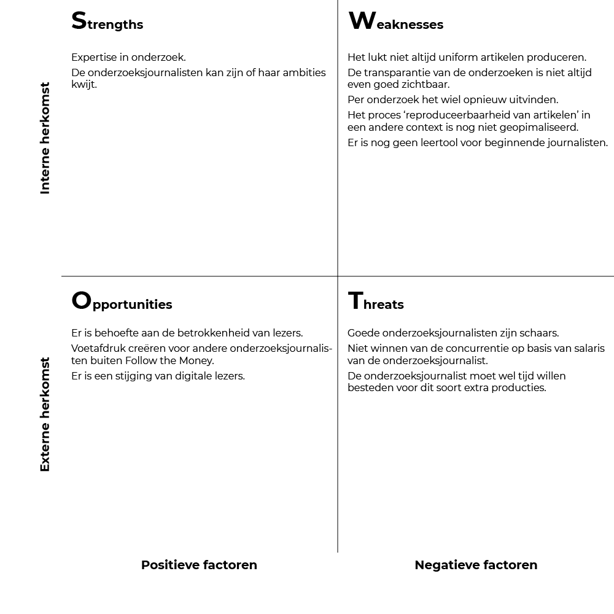

# SWOT analyse

## S W O T

* Strengths
* Weaknesses
* Opportunities
* Threats

## Waarom?

Deze methode geeft inzicht in waarin het bedrijf Follow the Money goed en minder goed in is maar ook de gevaren waarop gelet moet worden en waar kansen liggen. Deze SWOT is afgesteld op het gebruik van een blauwdruk binnen Follow the Money. Het doel is om inzichten te vergaren over de positie en onderzoeksrichtingen van het blauwdruk project.

## Uitvoering

SWOT analyse van het bedrijf Follow the Money.

  
[Afbeelding](https://github.com/IIYAMA12/Project-blauwdruk-documentation/tree/ff4c450705eac064247e95fdb265a4c1179f6467/docs/pages/research_methods/swot/content/swot.png)

### Strengths

Een belangrijke eigenschap van Follow the Money is dat er voldoende tijd wordt gereserveerd voor onderzoeksprocessen. Er is voldoende ruimte voor de onderzoeksjournalist zijn of haar ambities te vervullen en relatief grote onderzoeken uit te voeren.

### Weaknesses

Er is altijd nog ruimte voor het verbeteren, toegankelijk maken en versnellen van de onderzoeksprocessen. Momenteel is er nog geen middel voor om hier grote stappen mee te zetten.

### Opportunities

Door te focussen op het betrekking van de lezer en externe onderzoeksjournalisten kan de waardering voor `Follow the Money` groeien.

### Threats

Het in dienst nemen van goede onderzoeksjournalisten is een lastige opgave en dat is zeker het geval wanneer je concurrenten meer kunnen bieden qua salaris. Het verbreden van de productie kan als een drempel worden gezien wanneer deze zich voordoet als een verplichting.

